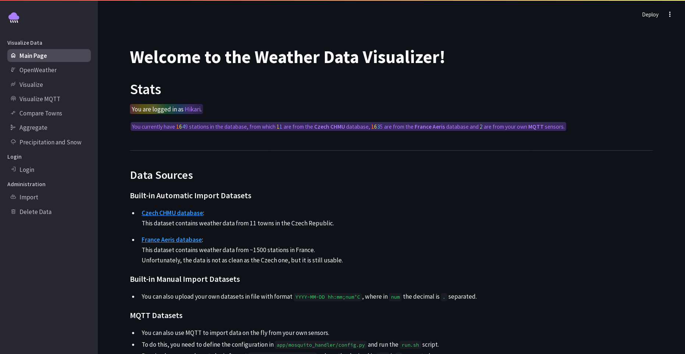
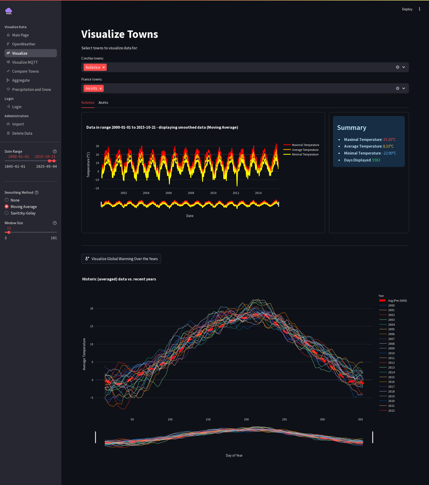
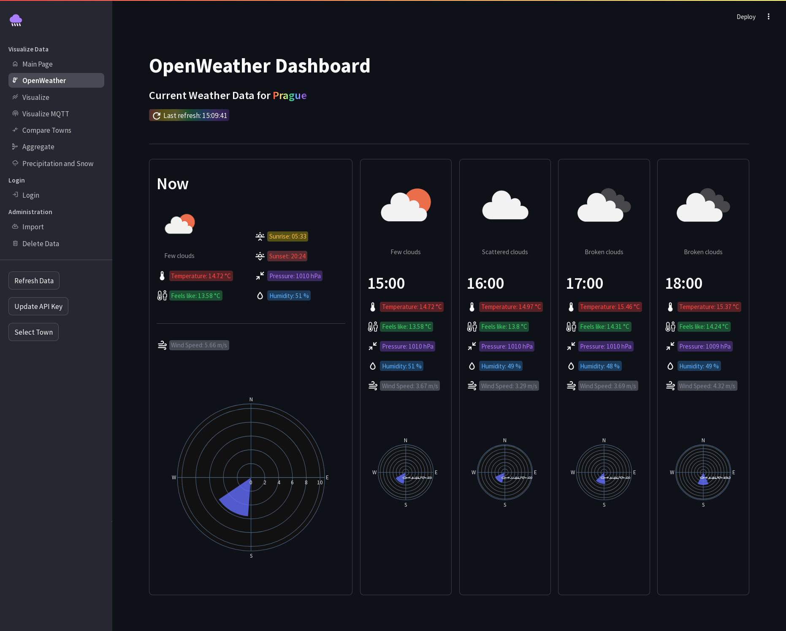
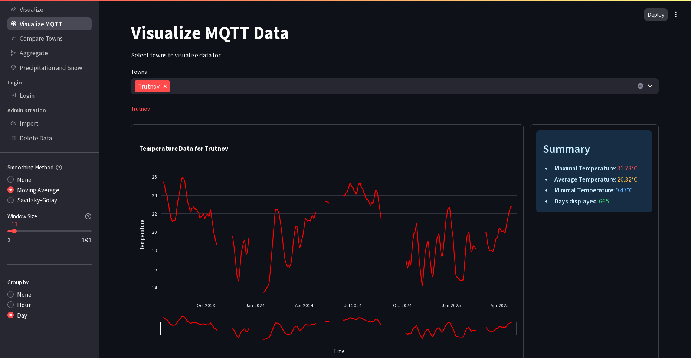
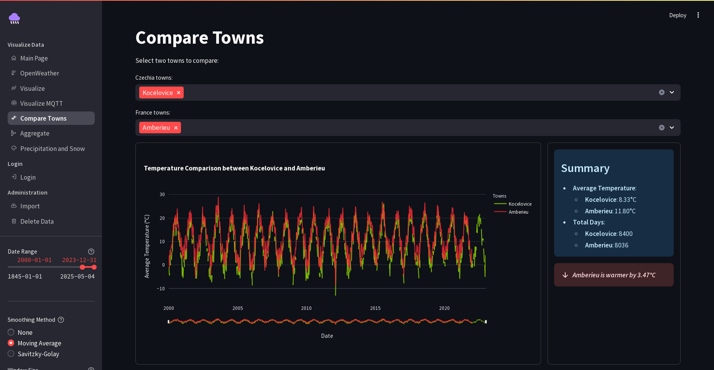
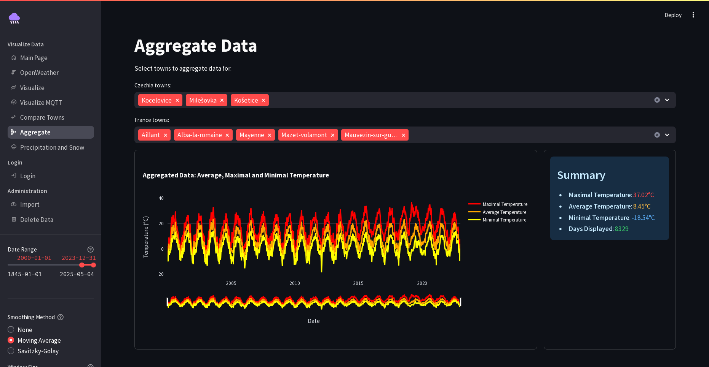
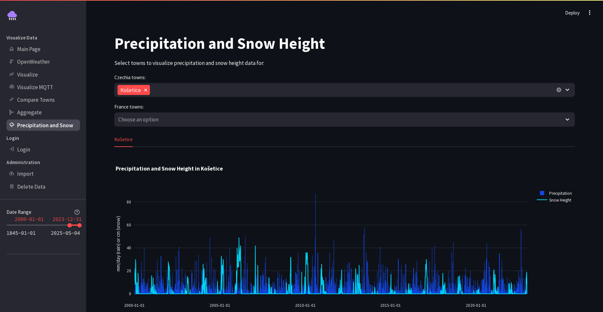
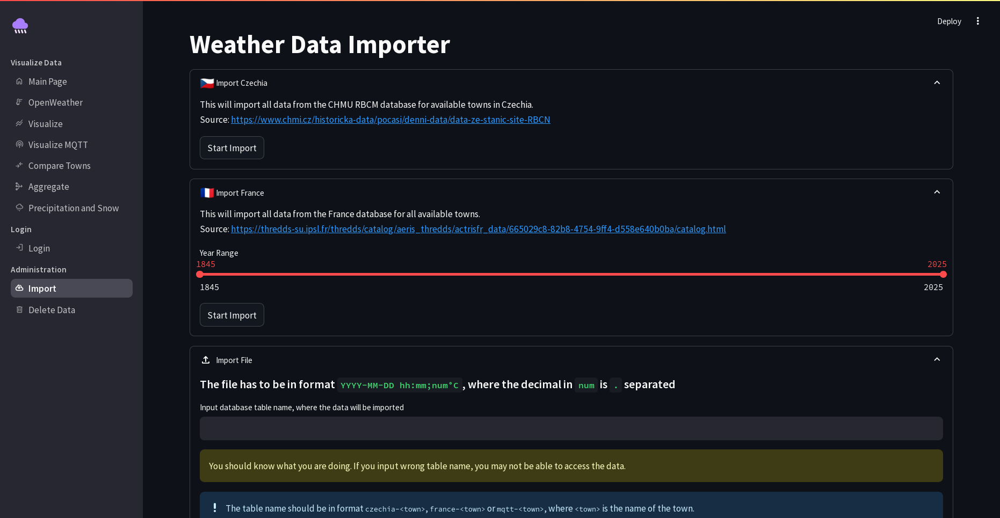

# 🌦️ Weather data visualizer

[](https://wakatime.com/badge/user/d150384a-c51c-4144-8898-22213a8a0f55/project/eb77f8cb-215c-40b4-a6b7-62a2acc1b2c8)
[](https://github.com/Hikari03/weather-data-visualizer)
[](https://github.com/Hikari03/weather-data-visualizer)

A web application for visualizing weather data from multiple sources with customizable parameters.

### See demo [here](https://weather.hikari03.cz/).

## ✨ Features
### Visualization Options
- **Metrics**:
    - 🌡️ Average/Min/Max temperature
    - 🌧️ Precipitation
    - ❄️ Snow height
- **Parameters**:
    - 📅 Date range
    - 📍 Station selection
    - 🔍 Data smoothing

### Data Sources
- **[CHMI](https://www.chmi.cz/historicka-data/pocasi/denni-data/data-ze-stanic-site-RBCN)** (Czech Hydrometeorological Institute) **❗❗SEE [THIS](#chmi-discontinued-source)❗❗**
- **[AERIS](https://www.aeris-data.fr/en/welcome-2/)** (French meteorological data) (Météo-France)
- **[OpenWeatherMap](https://openweathermap.org/)** (Weather data API)
- **Custom Data Input**:
    - 📡 MQTT/[Mosquitto](https://mosquitto.org/) broker integration
    - 📄 CSV file upload (single temperature datapoint per datetime only)

### Available Pages
| Page                   | Description                                                 |
|------------------------|-------------------------------------------------------------|
| **Visualize**          | View data from automatic imports (AERIS/CHMI)               |
| **OpenWeatherMap**     | View Forecast from OpenWeatherMap API <br/>(API Key needed) |
| **Visualize MQTT**     | View data from MQTT streams                                 |
| **Compare**            | Compare data from different sources                         |
| **Aggregate**          | Show combined metrics across stations                       |
| **Precipitation/Snow** | Specialized precipitation views                             |

### Admin Features (when logged in under admin email)
- **Import** - Add data from sources or CSV
- **Delete** - Remove station data

## Dependencies
If you want to use docker, you need to install it.  
Otherwise, you need to install the following dependencies:
- Python and pip and install the requirements from `requirements.txt`:
```bash
python -m venv .venv
source .venv/bin/activate
pip install -r requirements.txt
```

## Usage
### Configuration
 - Configure `.streamlit/secrets.template.toml` -> rename to `secrets.toml`.
 - MQTT: Configure `app/mosquitto_handler/config_template.py` -> rename to `config.py`.
 - For production: Use reverse proxy (nginx/traefik recommended) for https.


### Docker
- Run:
```bash
docker-compose up
```
- Open the browser and go to `http://localhost:8502/`.


### Without Docker
- You need to change credentials in `app/db_config.py` to your own database, app is tested with PostgreSQL.

- Run:
```bash
./run.sh
```


## Tests
- If you have a database running, you can run the tests with:
- You may have to change the database connection in `app/db_config.py` to your own database.
- **One test will fail.** To pass it, see [this](#chmi-discontinued-source).
```bash
pytest
```
- In the opposite case, you can run the tests with:
```bash
pytest -v -m "not real_database_connection"
```

### PIP8
Code is written in accordance with a PEP8 style guide, without C0301 (line length) and C0103 (variable name) checks.
- You can check the code with:
```bash
pylint --disable=C0301,C0103 -sn app main.py mqtt_process.py
```

#### Exceptions
| File                                        | Exception                                         | Reason                                                                                  |
|---------------------------------------------|---------------------------------------------------|-----------------------------------------------------------------------------------------|
| app/mosquitto_handler/connection.py:56      | unexpected-keyword-arg                            | Pylint doesnt see the correct constructor.                                              |
| app/mosquitto_handler/connection.py:56      | no-member                                         | Pylint doesnt see the correct constructor.                                              |
| app/importer/import_data_openweather.py:74  | too-many-instance-attributes                      | No way of making this smaller without losing readability                                |
| app/importer/import_data_openweather.py:123 | too-many-locals                                   | We need all these variables, making class would be less readable.                       |
| app/streamlit_pages/aggregate.py:22-27      | R0801                                             | Making one function for everything would lose readability.                              |
| app/streamlit_pages/town_visualize.py:20    | too-many-locals                                   | We need all these variables, making class would be less readable.                       |
| app/streamlit_pages/town_visualize.py:27-38 | R0801                                             | Making one function for everything would lose readability.                              |
| app/streamlit_pages/town_visualize.py:72    | too-many-arguments, too-many-positional-arguments | We need all these variables, making class would be less readable.                       |
| app/streamlit_pages/town_visualize.py:93    | R0801                                             | No need making a function when its just a graph config of few lines used on two places. |

# CHMI discontinued source
CHMI discontinued this [service](https://www.chmi.cz/historicka-data/pocasi/denni-data/data-ze-stanic-site-RBCN) and is now offering a new one
[here](https://opendata.chmi.cz/meteorology/climate/).
\
The import process is not compatible with this.

Fortunately, I have all the files saved.
You can get them [here](https://drive.google.com/file/d/1-TUF1Pavn9jtIrmO4TQ7t8Mq1-k10KhL/view?usp=sharing).
All you need to do now is create `data/downloaded` directories in the project root and paste the unzipped files there.
Then you can click the import button and it should import successfully.
\
When using docker, you need to remove the `data` directory from `.dockerignore` and rebuild.

# Screenshots

## Main Page

## Visualization
### Visualize

### OpenWeatherMap

### Visualize MQTT

### Compare

### Aggregate

### Precipitation/Snow

## Import



### Attributions
[Rain icons created by KP Arts - Flaticon](https://www.flaticon.com/free-icons/rain)